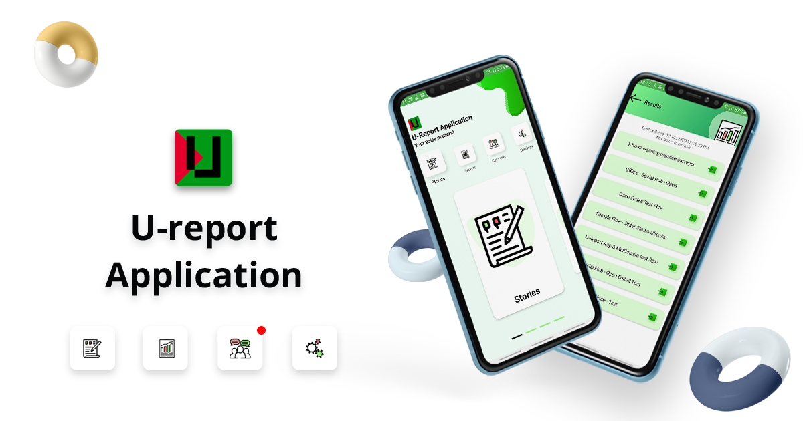
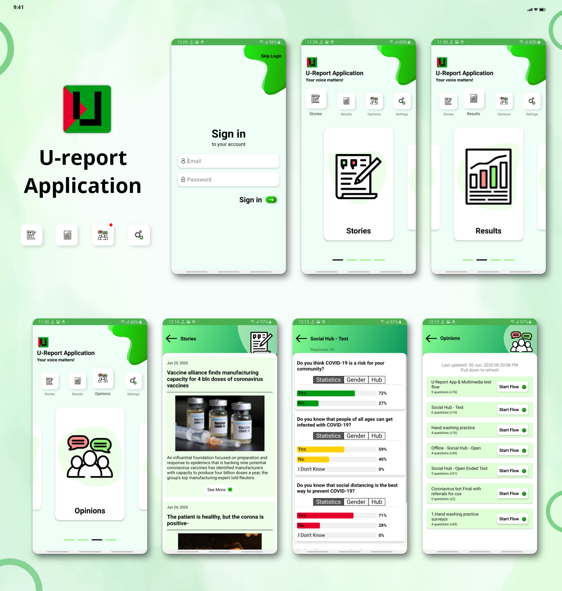

# U-Report Application
U-Report Application based on RapidPro and offline surveyor.

The whole system is based on 3 major components. 
* RapidPro server
* U-Report Offline server
* The U-Report Application. 

RapidPro server(s) are used to add Surveyor flows, which in turn will run on U-Report Application. U-Report Offline server process and converts flow run data from RapidPro into U-Report format. U-Report Application syncs data both U-Report Offline and RapidPro server. The application also runs the survey from RapidPro.